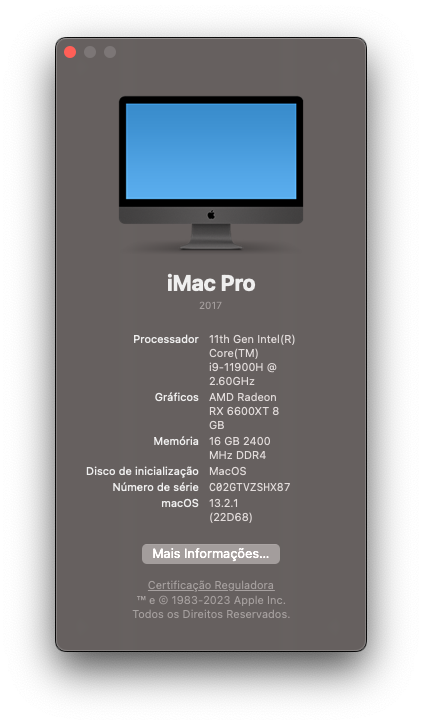

# hackintosh-i9-11900H

## Complete hardware specs

- Intel i9 11900H @ Overclocked (All cores 4.4Ghz)
- Mobo: Eryng HM570 Embedded cpu
- RX 6600 XT - Sapphire PULSE
- 2x 16Gb DDR4 3200Mhz Jazer XMP Enabled
- Wi-fi/BT Fenvi BCM94360NG - Work OOB

## What works

- [x] macOS versions: [ Big Sur, Monterey, Ventura, Sonoma ]
- [x] Audio
- [x] HDMI/DP (in dGPU - Works OOB)
- [x] Ethernet
- [x] Wi-fi/BT
- [x] All USB ports
- [x] Everything iCloud related (Drive, iMessage, Facetime, unlock with Apple Watch, etc)
- [x] Temperature monitoring for everything
- [x] DRM content (Netflix, ATV+, Airplay 2 mirroring etc)
- [x] Shutdown/Reboot/Update to newer macOS builds over time

## What doesn't work

- [ ] Sleep? await for test

## Kexts used

- Lilu.kext
- RealtekRTL8111.kext
- RadeonSensor.kext
- RestrictEvents.kext
- SMCProcessor.kext
- SMCRadeonGPU.kext
- SMCSuperIO.kext
- USBMap.kext
- VirtualSMC.kext
- WhateverGreen.kext
